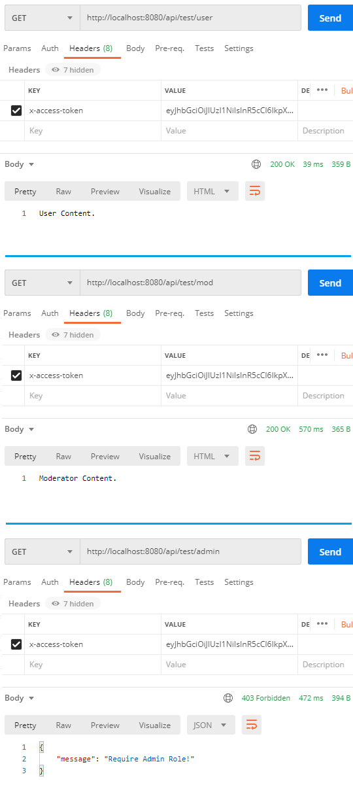

# pern-auth

### Create Express App

```bash
npx express-generator api
cd api
npm install
npm start
```

Install Dependencies

### Create Express App

In api folder run the next command to install necessary packages

```bash
npm install express sequelize pg pg-hstore cors jsonwebtoken bcryptjs dotenv --save
```
And add this code:


express app default port is 3000, set it to 8080 in file api/bin/www like this


### Configure  PostgreSQL  database & Sequelize

In the app folder, we create a separate config folder for configuration with db.config.js file like this:

```js
module.exports = {
    HOST: process.env.DB_HOST,
    USER: process.env.DB_USER,
    PASSWORD: process.env.DB_PASSWORD,
    DB: process.env.DB_NAME,
    dialect: process.env.DB_DIALECT,
    PORT: process.env.DB_PORT,
    pool: {
      max: parseInt(process.env.DB_POOL_MAX),
      min: parseInt(process.env.DB_POOL_MIN),
      acquire: parseInt(process.env.DB_POOL_ACQUIRE),
      idle: parseInt(process.env.DB_POOL_IDLE)
    },
    secret: process.env.AUTH_SECRET
  };
```

under api directory rename .env.development as .env and edit acordingly

```
DB_HOST=localhost
DB_USER=pernauth
DB_PASSWORD=pernauthpwd
DB_NAME=pernauthdb
DB_DIALECT=postgres
DB_PORT=5433
DB_POOL_MAX=5
DB_POOL_MIN=0
DB_POOL_ACQUIRE=30000
DB_POOL_IDLE=10000
AUTH_SECRET=pern-auth-secret-key
```

#### Define the Sequelize Model

In models folder, create users.model.js file like this:

```js
module.exports = (sequelize, Sequelize) => {
  const User = sequelize.define("users", {
    username: {
      type: Sequelize.STRING
    },
    email: {
      type: Sequelize.STRING
    },
    password: {
      type: Sequelize.STRING
    }
  });

  return User;
};
```

In models folder, create role.model.js file like this:

```js
module.exports = (sequelize, Sequelize) => {
  const Role = sequelize.define("roles", {
    id: {
      type: Sequelize.INTEGER,
      primaryKey: true
    },
    name: {
      type: Sequelize.STRING
    }
  });

  return Role;
};
```

These Sequelize Models represents users & roles table in PostgreSQL database.

After initializing Sequelize, we don’t need to write CRUD functions, Sequelize supports all of them:

create a new User: create(object)
find a User by id: findByPk(id)
find a User by email: findOne({ where: { email: ... } })
get all Users: findAll()
find all Users by username: findAll({ where: { username: ... } })
These functions will be used in our Controllers and Middlewares.

#### Initialize Sequelize

Now create app/models/index.js with the following code:

``` js
const dbConfig = require("../config/db.config.js");

const Sequelize = require("sequelize");
const sequelize = new Sequelize(dbConfig.DB, dbConfig.USER, dbConfig.PASSWORD, {
  host: dbConfig.HOST,
  dialect: dbConfig.dialect,
  operatorsAliases: false,
  port: dbConfig.PORT,
  pool: {
    max: dbConfig.pool.max,
    min: dbConfig.pool.min,
    acquire: dbConfig.pool.acquire,
    idle: dbConfig.pool.idle
  }
});

const db = {};

db.Sequelize = Sequelize;
db.sequelize = sequelize;

db.user = require("./user.model.js")(sequelize, Sequelize);
db.role = require("./role.model.js")(sequelize, Sequelize);

db.role.belongsToMany(db.user, {
  through: "user_roles"
});
db.user.belongsToMany(db.role, {
  through: "user_roles"
});

db.ROLES = ["user", "admin", "moderator"];

module.exports = db;
```

Don’t forget to call sync() method in server.js:

```js
const app = express();
app.use(...);

const db = require("./app/models");
db.sequelize.sync();
```

In development, you may need to drop existing tables and re-sync database. Just use force: true as following code:

```js
db.sequelize.sync({ force: true }).then(() => {
  console.log("Drop and re-sync db.");
});
```

Don’t forget to call sync() method in server.js.

```js
...
const app = express();
app.use(...);

const db = require("./app/models");
const Role = db.role;

db.sequelize.sync({force: true}).then(() => {
  console.log('Drop and Resync Db');
  initial();
});

...
function initial() {
  Role.create({
    id: 1,
    name: "user"
  });
 
  Role.create({
    id: 2,
    name: "moderator"
  });
 
  Role.create({
    id: 3,
    name: "admin"
  });
}
```
### Create Middleware functions

To verify a Signup action, we need 2 functions:
– check if username or email is duplicate or not
– check if roles in the request is existed or not

middleware/verifySignUp.js

```js
const db = require("../models");
const ROLES = db.ROLES;
const User = db.user;

checkDuplicateUsernameOrEmail = (req, res, next) => {
  // Username
  User.findOne({
    where: {
      username: req.body.username
    }
  }).then(user => {
    if (user) {
      res.status(400).send({
        message: "Failed! Username is already in use!"
      });
      return;
    }

    // Email
    User.findOne({
      where: {
        email: req.body.email
      }
    }).then(user => {
      if (user) {
        res.status(400).send({
          message: "Failed! Email is already in use!"
        });
        return;
      }

      next();
    });
  });
};

checkRolesExisted = (req, res, next) => {
  if (req.body.roles) {
    for (let i = 0; i < req.body.roles.length; i++) {
      if (!ROLES.includes(req.body.roles[i])) {
        res.status(400).send({
          message: "Failed! Role does not exist = " + req.body.roles[i]
        });
        return;
      }
    }
  }
  
  next();
};

const verifySignUp = {
  checkDuplicateUsernameOrEmail: checkDuplicateUsernameOrEmail,
  checkRolesExisted: checkRolesExisted
};

module.exports = verifySignUp;
```


To process  Authentication &  Authorization, we have these functions:
- check if token is provided, legal or not. We get token from x-access-token of HTTP headers, then use jsonwebtoken's verify() function.
- check if roles of the user contains required role or not.

middleware/authJwt.js

```js
const jwt = require("jsonwebtoken");
const config = require("../config/auth.config.js");
const db = require("../models");
const User = db.user;

verifyToken = (req, res, next) => {
  let token = req.headers["x-access-token"];

  if (!token) {
    return res.status(403).send({
      message: "No token provided!"
    });
  }

  jwt.verify(token,
            config.secret,
            (err, decoded) => {
              if (err) {
                return res.status(401).send({
                  message: "Unauthorized!",
                });
              }
              req.userId = decoded.id;
              next();
            });
};

isAdmin = (req, res, next) => {
  User.findByPk(req.userId).then(user => {
    user.getRoles().then(roles => {
      for (let i = 0; i < roles.length; i++) {
        if (roles[i].name === "admin") {
          next();
          return;
        }
      }

      res.status(403).send({
        message: "Require Admin Role!"
      });
      return;
    });
  });
};

isModerator = (req, res, next) => {
  User.findByPk(req.userId).then(user => {
    user.getRoles().then(roles => {
      for (let i = 0; i < roles.length; i++) {
        if (roles[i].name === "moderator") {
          next();
          return;
        }
      }

      res.status(403).send({
        message: "Require Moderator Role!"
      });
    });
  });
};

isModeratorOrAdmin = (req, res, next) => {
  User.findByPk(req.userId).then(user => {
    user.getRoles().then(roles => {
      for (let i = 0; i < roles.length; i++) {
        if (roles[i].name === "moderator") {
          next();
          return;
        }

        if (roles[i].name === "admin") {
          next();
          return;
        }
      }

      res.status(403).send({
        message: "Require Moderator or Admin Role!"
      });
    });
  });
};

const authJwt = {
  verifyToken: verifyToken,
  isAdmin: isAdmin,
  isModerator: isModerator,
  isModeratorOrAdmin: isModeratorOrAdmin
};
module.exports = authJwt;

```

middleware/index.js

```js
const authJwt = require("./authJwt");
const verifySignUp = require("./verifySignUp");

module.exports = {
  authJwt,
  verifySignUp
};
```

### Create Controllers
#### Controller for Authentication
There are 2 main functions for Authentication:
- signup: create new User in database (role is user if not specifying role)
- signin:

find username of the request in database, if it exists
compare password with password in database using bcrypt, if it is correct
generate a token using jsonwebtoken
return user information & access Token
controllers/auth.controller.js

```js
const db = require("../models");
const config = require("../config/auth.config");
const User = db.user;
const Role = db.role;

const Op = db.Sequelize.Op;

var jwt = require("jsonwebtoken");
var bcrypt = require("bcryptjs");

exports.signup = (req, res) => {
  // Save User to Database
  User.create({
    username: req.body.username,
    email: req.body.email,
    password: bcrypt.hashSync(req.body.password, 8)
  })
    .then(user => {
      if (req.body.roles) {
        Role.findAll({
          where: {
            name: {
              [Op.or]: req.body.roles
            }
          }
        }).then(roles => {
          user.setRoles(roles).then(() => {
            res.send({ message: "User was registered successfully!" });
          });
        });
      } else {
        // user role = 1
        user.setRoles([1]).then(() => {
          res.send({ message: "User was registered successfully!" });
        });
      }
    })
    .catch(err => {
      res.status(500).send({ message: err.message });
    });
};

exports.signin = (req, res) => {
  User.findOne({
    where: {
      username: req.body.username
    }
  })
    .then(user => {
      if (!user) {
        return res.status(404).send({ message: "User Not found." });
      }

      var passwordIsValid = bcrypt.compareSync(
        req.body.password,
        user.password
      );

      if (!passwordIsValid) {
        return res.status(401).send({
          accessToken: null,
          message: "Invalid Password!"
        });
      }

      const token = jwt.sign({ id: user.id },
                              config.secret,
                              {
                                algorithm: 'HS256',
                                allowInsecureKeySizes: true,
                                expiresIn: 86400, // 24 hours
                              });

      var authorities = [];
      user.getRoles().then(roles => {
        for (let i = 0; i < roles.length; i++) {
          authorities.push("ROLE_" + roles[i].name.toUpperCase());
        }
        res.status(200).send({
          id: user.id,
          username: user.username,
          email: user.email,
          roles: authorities,
          accessToken: token
        });
      });
    })
    .catch(err => {
      res.status(500).send({ message: err.message });
    });
};
```

Controller for testing Authorization
There are 4 functions:
– /api/test/all for public access
– /api/test/user for loggedin users (role: user/moderator/admin)
– /api/test/mod for users having moderator role
– /api/test/admin for users having admin role

controllers/user.controller.js

```js
exports.allAccess = (req, res) => {
  res.status(200).send("Public Content.");
};

exports.userBoard = (req, res) => {
  res.status(200).send("User Content.");
};

exports.adminBoard = (req, res) => {
  res.status(200).send("Admin Content.");
};

exports.moderatorBoard = (req, res) => {
  res.status(200).send("Moderator Content.");
};
```

### Define Routes
When a client sends request for an endpoint using HTTP request (GET, POST, PUT, DELETE), we need to determine how the server will response by setting up the routes.

We can separate our routes into 2 part: for Authentication and for Authorization (accessing protected resources).

Authentication:

POST /api/auth/signup
POST /api/auth/signin

routes/auth.routes.js

```js
var express = require('express');
const { verifySignUp } = require("../middleware");
const controller = require("../controllers/auth.controller");
var router = express.Router();

// Create a new User
router.post("/signup", 
    verifySignUp.checkDuplicateUsernameOrEmail, //Middleware
    verifySignUp.checkRolesExisted, //Middleware
    controller.signup);

router.post("/signin", controller.signin);

module.exports = router;
```

Authorization:

GET /api/test/all
GET /api/test/user for loggedin users (user/moderator/admin)
GET /api/test/mod for moderator
GET /api/test/admin for admin

routes/user.routes.js

```js
var express = require('express');
var router = express.Router();
const { authJwt } = require("../middleware");
const controller = require("../controllers/user.controller");

router.get("/all", controller.allAccess);

router.get("/user", 
  authJwt.verifyToken,
  controller.userBoard);

  router.get("/mod", 
    authJwt.verifyToken,
    authJwt.isModerator,
    controller.moderatorBoard);

  router.get("/admin", 
    authJwt.verifyToken,
    authJwt.isAdmin,
    controller.adminBoard);

module.exports = router;
```

Don't forget app.js should look like this:
```js
...

require('dotenv').config();
var createError = require('http-errors');
var express = require('express');
var path = require('path');
var cookieParser = require('cookie-parser');
var logger = require('morgan');
const cors = require("cors");

var indexRouter = require('./routes/index');
var usersRouter = require('./routes/user.routes');
var authRouter = require('./routes/auth.routes');

var app = express();


const db = require("./models");
const Role = db.role;

db.sequelize.sync({force: true}).then(() => { //For production, just insert these rows manually and use sync() without parameters to avoid dropping data:
  console.log('Drop and Resync Db');
  initial();
});


var corsOptions = {
  origin: "http://localhost:8081"
};

app.use(cors(corsOptions));

// view engine setup
app.set('views', path.join(__dirname, 'views'));
app.set('view engine', 'jade');

app.use(logger('dev'));
// parse requests of content-type - application/json
app.use(express.json());
// parse requests of content-type - application/x-www-form-urlencoded
app.use(express.urlencoded({ extended: false }));
app.use(cookieParser());
app.use(express.static(path.join(__dirname, 'public')));

app.use('/', indexRouter);
app.use('/users', usersRouter);
app.use('/api/auth', authRouter);

// catch 404 and forward to error handler
app.use(function(req, res, next) {
  next(createError(404));
});

// error handler
app.use(function(err, req, res, next) {
  // set locals, only providing error in development
  res.locals.message = err.message;
  res.locals.error = req.app.get('env') === 'development' ? err : {};

  // render the error page
  res.status(err.status || 500);
  res.render('error');
});

module.exports = app;

function initial() {
  Role.create({
    id: 1,
    name: "user"
  });
 
  Role.create({
    id: 2,
    name: "moderator"
  });
 
  Role.create({
    id: 3,
    name: "admin"
  });
}
...
```

Register some users with /signup API:


Our tables after registration could look like this.

```sql
testdb=# select * from users;
 id | username |       email        |                           password                           |         createdAt          |         updatedAt
----+----------+--------------------+--------------------------------------------------------------+----------------------------+----------------------------
  1 | admin    | admin@bezkoder.com | $2a$08$T0B0i/96KE90jAYPOhpsN.vJGVPMfFw.FbxljzuQkkN4ZK3YauRLq | 2020-11-19 21:20:49.305+07 | 2020-11-19 21:20:49.305+07
  2 | mod      | mod@bezkoder.com   | $2a$08$CmCiT5Y/9OTUM0ofSP2r2eQSHVIcqhjp1wH.GYA5oPcRlJ7Hr2C66 | 2020-11-19 21:21:13.67+07  | 2020-11-19 21:21:13.67+07
  3 | user     | user@bezkoder.com  | $2a$08$f.exOM3efA4DF4BtohzhAOzcv2.iCppJIbdSHFLRmka569sCNXfSe | 2020-11-19 21:23:00.978+07 | 2020-11-19 21:23:00.978+07
(3 rows)


testdb=# select * from user_roles;
         createdAt          |         updatedAt          | roleId | userId
----------------------------+----------------------------+--------+--------
 2020-11-19 21:20:50.045+07 | 2020-11-19 21:20:50.045+07 |      3 |      1
 2020-11-19 21:21:14.604+07 | 2020-11-19 21:21:14.604+07 |      1 |      2
 2020-11-19 21:21:14.604+07 | 2020-11-19 21:21:14.604+07 |      2 |      2
 2020-11-19 21:23:02.1+07   | 2020-11-19 21:23:02.1+07   |      1 |      3
(4 rows)
```

Access public resource: GET /api/test/all


Access protected resource: GET /api/test/user


Login an account (with wrong password): POST /api/auth/signin


Login a correct account: POST /api/auth/signin


**Access protected resources:**

GET /api/test/user
GET /api/test/mod
GET /api/test/admin


